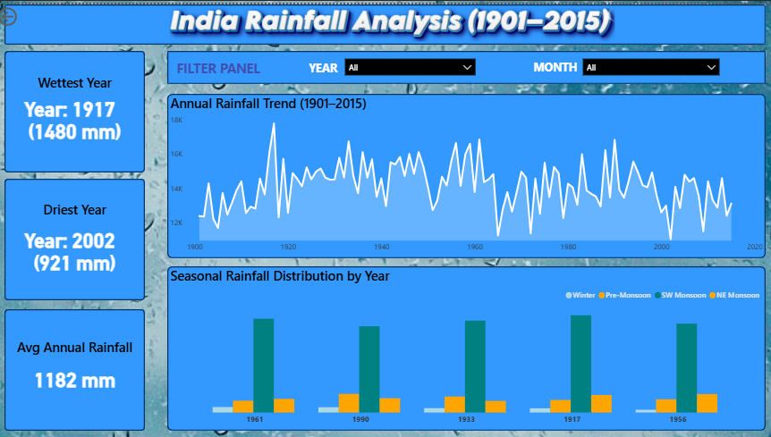

# 🌧️ India Rainfall Analysis (1901–2015)

An interactive **Power BI dashboard** analyzing India’s rainfall data from **1901 to 2015** to explore long-term trends, seasonal patterns, and extreme rainfall years.

---

## 📸 Dashboard Preview

---

## 📊 Project Overview
- **Duration:** 1901–2015  
- **Columns:** REGION, YEAR, JAN–DEC, ANNUAL, Jan–Feb, Mar–May, Jun–Sep, Oct–Dec  
- **Seasons:**  
  - Winter → Jan–Feb  
  - Pre-Monsoon → Mar–May  
  - SW Monsoon → Jun–Sep  
  - NE Monsoon → Oct–Dec  

---

## 📈 Dashboard Highlights
- **KPI Cards:**  
  - Wettest Year → 1917 (1480 mm)  
  - Driest Year → 2002 (921 mm)  
  - Average Annual Rainfall → 1182 mm  
- **Line Chart:** Annual Rainfall Trend (1901–2015)  
- **Bar Chart:** Seasonal Rainfall Distribution by Year  
- **Filters:** Year & Month  

---

## 🛠️ Tools Used
Power BI • Excel • DAX  

---

## 💡 Insights
- Monsoon (Jun–Sep) contributes the most rainfall  
- Rainfall fluctuates widely across decades  
- Helps visualize India’s long-term climate trends  

---

## 🚀 How to Use
1. Download or clone the repo.  
2. Open the `.pbix` file in **Power BI Desktop**.  
3. Use the filters to explore rainfall trends interactively.

---

✨ *Created using Power BI to visualize 115 years of India’s rainfall history.*
